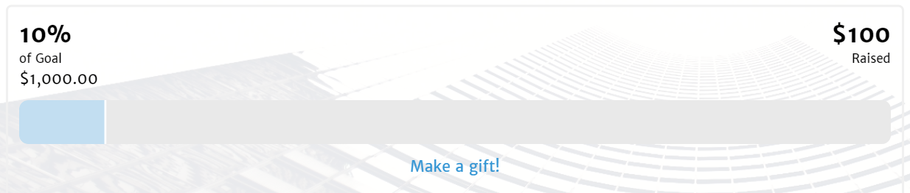

@{
  Layout = "blogpost";
  Title = "Big Climb Fundraising for the Leukemia and Lymphoma Society";
  Tags = "leukemia, big climb, LLS";
  Date = "2015-02-22T23:37:13Z";
  Description = "Fundraising for the Leukemia and Lymphoma society";
  EntryId = "entry150223-003713";
}
# Big Climb Fundraising for the Leukemia and Lymphoma Society 

Do you want to help blood cancer research? You can do that by donating at 
[my Big Climb fundraising page](http://www.llswa.org/site/TR/Events/BigClimb?px=1696060&amp;pg=personal&amp;fr_id=1460) before March 22nd.

The Big Climb is a stairclimb up the Columbia Center - the tallest skyscraper in downtown Seattle. There are 69 flights of stairs, 1311 steps, and 788 feet of vertical elevation. All proceeds benefit the [Leukemia and Lymphoma Society](http://www.lls.org/).

Thank you for your support!

[Donate ](https://secure3.convio.net/llswa/site/Donation2;jsessionid=BFBEAB6B63531D2C0F87B276B1DEEDC5.app338b?2104.donation=form1&amp;idb=1865941136&amp;df_id=2104&amp;FR_ID=1460&amp;PROXY_ID=1696060&amp;PROXY_TYPE=20)