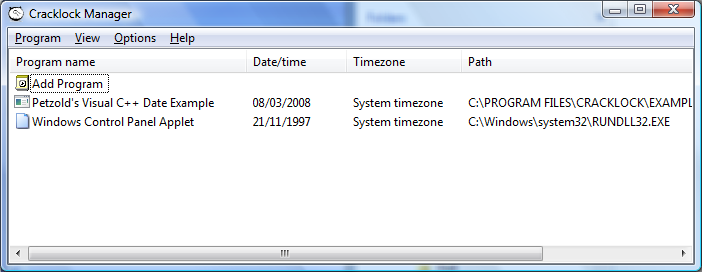
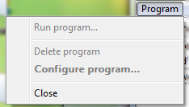
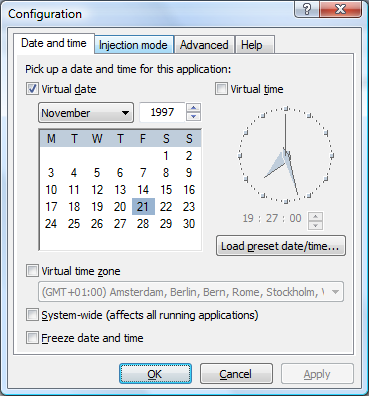
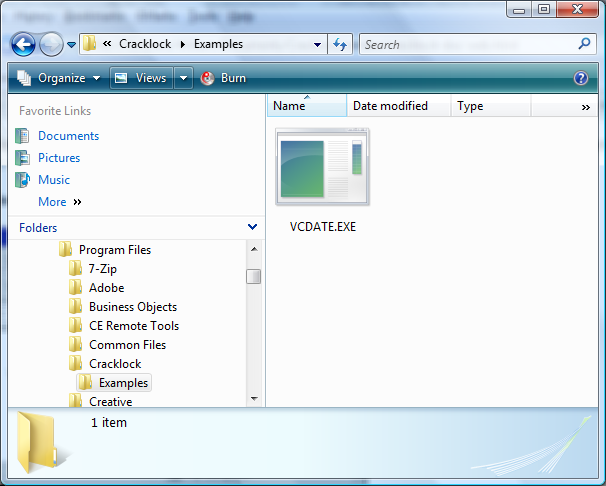
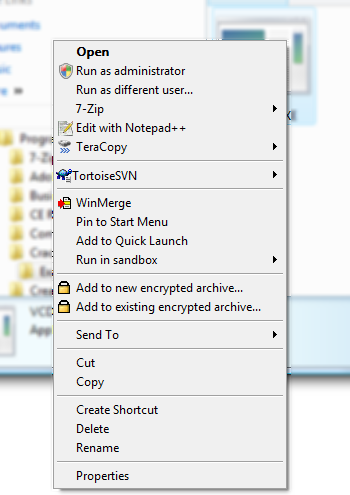
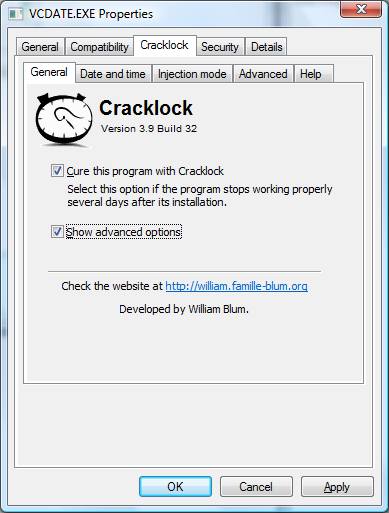
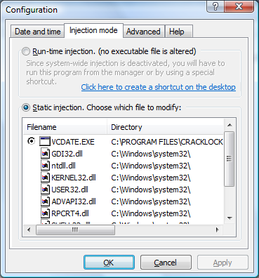
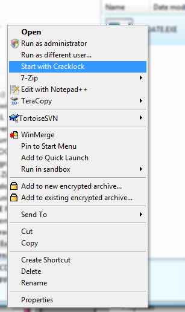

@{
  Layout = "page";
  Title = "Cracklock documentation";
  Tags = "Cracklock";
  Date = "";
  Description = "Cracklock documentation";
}
Cracklock documentation
=======================

------------------------------------------------------------------------

### <span id="id685009"></span>Introduction


Freeware, No Adware, No Spyware.

The current version support all 32 bits versions of Windows from NT to Vista (NT/2K/XP/Vista). For legacy version of Windows (95, 98 or ME), please download version 3.8.3 from my [website](https://william.famille-blum.org/).

For the latest version, check the website at [https://william.famille-blum.org](https://william.famille-blum.org/).

You probably know the most polymorphic and sadistic virus of this ending century, the so-called "30th day virus". It attacks the best sharewares as well as the worst ones, introducing as soon as you install them a bug that prevents them from running beyond a random delay, often 30 days. Cracklock has the leadership in the fighting challenge against this virus that even McAfee, Norton, Sophos, Thunderbyte and F-Proot seem unable to deal with.

Cracklock is also a tool that developpers may use to check Y2K-like compatibility for their products without having to change the system time, thus avoiding side-effects.

#### <span id="id685053"></span>What's new ?

It is now possible to run Cracklock from a usb flashdisk. In this mode, the settings are saved on disk in a Cracklock.settings file. By default this file is stored along with cracklock binaries. An option let you tell cracklock to save the settings in the current user's Appdata folder or in the Windows registry.

Another option can be set to store the per-application settings in each application's directory. If you run an executable file called "App.exe" that is (statically or run-time) injected by Cracklock and if there exists an associated configuration file called "App.exe.cracklock" next to it in the application directory then Cracklock will load the settings from that file instead of the general cracklock setting storage (the registry or the main setting file).

[Click here to see the full changelog.](#changelog "Change logs")

#### <span id="id685076"></span>Features

-   A new installation program: simplifies the install process of Cracklock.

-   The Manager: an interface which allows you to set up each Cracklock-controlled software an easier and faster way.

-   Multilingual: Cracklock has been translated to many languages.

-   Contextual help: you can obtain help from anywhere, at any time !

#### <span id="id685117"></span>Installation

Just run the setup executable file and follow the instructions on the screen.

<span class="bold">**Note to users of older versions of Cracklock:**</span> If a previous version of Cracklock is installed on your computer, it is better to uninstall it before installing the new version.

#### <span id="id685135"></span>Uninstallation

Choose "Cracklock" from the list of applications in the <span class="bold">**Add/Remove programs**</span> applet of the Windows control panel.

### <span id="id685152"></span>Usage

#### <span id="id685158"></span>How does it work?

Cracklock controls a list of programs you set up. When a program from this list needs time or date, Cracklock operates, bluffing the calling program and returning the pre-determined date or time you have set. So, the program "thinks" to be at the date/time it accepts for running.

<span class="term">For the end user</span>
Cracklock protects you from the 30th day bug, a defect that is becoming very frequent in nowadays software. A program affected by this bug will fail to run when a certain period of time has passed after its installation.

<span class="term">For the developer: a safe method for Y2K testing</span>
With the help of Cracklock, developers can readily test or check the "Year 2000 compatibility" (Y2K) of their software.

Suppose that you want to check the program you are developing for Y2K compatibility. To perform the test you decide to change the global system date/time to 31th december 1999 and then launch your program in order to debug it. The drawback of this method is that it affects all the programs currently running on the machine. One consequence is that the date stamp of the files created or modified by any software running on Windows will be set to 31th december 1999.

Some other software may even stop working, as if they were "lost in time". That would be the case for all these poorly developed softwares that are affected by the notorious "30th day bug". If you run such software while you are testing your program against Y2K compliance, then you will run into trouble: the bugged sofware will be confused about the date and will stop working.

Cracklock overcomes all these problems by allowing you to specify the date on an application basis.

#### <span id="configuration"></span>Setting up an application for Cracklock

Start the manager (shortcut <span class="bold">**Cracklock Manager**</span> in start menu):

<span id="id685227"></span>
**Figure 1. The manager**



The Manager lets you add and configure application to be controlled by Cracklock. It lets you do the following 3 basic functions: adding a new application, configure the date and time parameters for an application, and execute the program (though it is not required to launch your applications from the manager).

##### <span id="id685250"></span>Adding applications

To add an application to the list of applications controled by Cracklock, click twice on the <span class="bold">**Add program**</span> and then select the executable file of your application. A dialog box will show up to let you configure the parameters for this application.

Note : The application must be a valid 32bits Windows application compatible with Windows 95/98/NT/XP.

##### <span id="id685269"></span>Configurating a program for use with Cracklock

Select the program that you want to configure in the manager list. Click on the "Program" menu then on "Settings...":

<span id="id685279"></span>
**Figure 2. Program menu**



This brings you the configuration dialog box:

<span id="id685302"></span>
**Figure 3. Configuration window**



Choose a date and time using the calendar and clock controls.

Click on "Load preset date/time" in order to load a predefine date/time among the following: the current system date and time, the file creation date/time, the file's last modification date/time.

You can restrict Cracklock to only affect the time, the date or both by selection the approriate raddio button. For instance if you choose to alter the time only then the program will run with the system date but with a fake time. If you choose "date and time" then both will be faked by Cracklock.

##### <span id="id685338"></span>Configuring your applications from the Explorer

You can configure application for Cracklock directly from the Windows Explorer without having to use the Manager. In Windows Explorer, open the directory containing the executable file of your program.

<span id="id685347"></span>
**Figure 4. Windows Explorer**



Right-click on the executable file. A contextual menu appears:

<span id="id685371"></span>
**Figure 5. Context menu in Windows Explorer**



In this menu, select "Properties". A window with several tabs show up, select the tab named Cracklock:

<span id="id685394"></span>
**Figure 6. Cracklock configuration window**



If you want to enable Cracklock for this program, check the box <span class="bold">**Cure this program with Cracklock**</span>. Check <span class="bold">**Show advanced options**</span> to show the tabs from the configuration dialog box from the manager.

##### <span id="id685428"></span>Advanced options

You may need to tweak some parameters in some cases to make your application work with Cracklock.

<span class="term">System-wide</span>
This will affect the system date and time. With this option, each time you run the controlled program, the system computer time and date will be changed to the date/time that you have specified. When the program ends, date and time will be restored to the actual date and time, taking account of elapsed time during usage of the program.

 The drawback of this method is that all programs running simultaneously are affected together, Cracklock in its native method being precisely designed to affect specific date and time to each program running at one given moment and to avoid this inconvenience.

 This option reproduces what you can do yourself manually without Cracklock, with the "date" or "time" commands under MS/DOS or with the configuration panel under Windows. In my mind, it has no real benefit.

<span class="term">Freeze date and time</span>
This "freeze" option allows to set a date/time which never changes, as if the time was frozen. Useful for programs that work only during a few hours or minutes.

 For example, if you set 10:00:00 09/22/1981 for this program, during all the run it will "think" the time is 10:00:00 09/22/1981.Ten minutes later, the time will still be 10:00:00 09/22/1981 for the application. If the option is not selected, however, at the start the program will have a time of 10:00:00 09/22/1981, and ten minutes later it will be 10:10:00 09/22/1981.

<span class="term">Injection mode</span>
In the "injection mode" tab of the configuration window, you can select between two different modes: static or run-time

With static-injection, Cracklock will alter the executable file of your application in order to make it load Cracklock. You can additionally tell Cracklock which file it should modify by selecting an executable file among the list of dependencies of your application.The license that you signed when you install a software often prevents you from modifying its executable files - even for the purpose of correcting a bug, as in the present case - so if you have signed such a license then you must not use static injection.

The other mode is "run-time injection":



Using the run-time injection, Cracklock does not modify any executable file from your application, everything happens at run-time. Note that in this case you need to make sure that the system-wide injection is activated otherwise you will have to start the program from a special shortcut or from wihtin the manager.

#### <span id="id685512"></span>Starting an application

To execute a program under the control of Cracklock, you can either run it as usual from the shortcut in the <span class="bold">**"Start"**</span> menu, or selecting the program in the manager and clicking on the <span class="bold">**Execute**</span> menu.

<span class="bold">**Special case:** </span>If the run-time injection mode is selected for the application and if system-wide injection is deactivated then then you cannot run the program in the normal way. In this case, you can start your application using one of the following methods:

-   Launch your application from Cracklock manager,

-   Open up the "injection mode" tab in the configuration window in the Cracklock manager and click on the link to create a desktop shortcut. You can then run the application directly from this shortcut.

-   Start the following command:

    ``` programlisting
    "C:\PROGRAM FILES\Cracklock\MCL.EXE" C:\APP\APP.EXE [program_parameters]
    ```

    where "C:\\PROGRAM FILES\\Cracklock\\MCL.EXE" is the full path to the MCL.EXE file installed in the Cracklock directory, C:\\APP\\APP.EXE is the full path to the executable .EXE file of your program, and \[program\_parameters\] are the optional parameters required by your program.

    From the Windows Explorer, go to the folder containing your application executable file:

    

-   Right-click on the executable file to bring up the context menu:

    

    and select the <span class="bold">**"Start with Cracklock"**</span> option.

#### <span id="id685611"></span>Examples

Cracklock comes with two example applications showing the system date/time. To check that Cracklock works correctly, you can try to configure these two examples in the Manager. These two aplications are located in the "Examples" subfolder of the Cracklock directory.

<span id="id685621"></span>
**Table 1. Examples**

| File       | Description                                                                                | Programming language |
|------------|--------------------------------------------------------------------------------------------|----------------------|
| vcdate.exe | DigClock program from the book Programming Windows 95 by Charles Petzold (Microsoft Press) | Visual C++           |
| vbdate.exe | A test program of my own.                                                                  | Visual Basic 5.0     |

### <span id="id685704"></span>Known limitations

-   Under Windows NT, Cracklock cannot modify system files like MSVCRT.DLL that are located in the system directory,

-   the current version of Cracklock doesn't recognize programs configurated with the 1.x and 2.x versions,

-   Cracklock does not work with 16 bits programs (those designed for Windows 3.1).

### <span id="id685740"></span>Miscellaneous

#### <span id="id685746"></span>EULA

NO WARRANTY. The Software is being delivered to you "AS IS" and the Author makes no warranty as to its use or performance. The Author provides no technical support, warranties or remedies for the Software. THE AUTHOR AND ITS SUPPLIERS DO NOT AND CANNOT WARRANT THE PERFORMANCE OR RESULTS YOU MAY OBTAIN BY USING THE SOFTWARE.

LIMITATION OF LIABILITY. IN NO EVENT WILL THE AUTHOR OF CRACKLOCK OR ITS SUPPLIERS BE LIABLE TO YOU FOR ANY DAMAGES, CLAIMS OR COSTS WHATSOEVER OR ANY CONSEQUENTIAL, INDIRECT, INCIDENTAL DAMAGES, OR ANY LOST PROFITS OR LOST SAVINGS.

I assume no responsibility for any use nor effects subsequent to the use of Cracklock. Crackclock is not intended for illegal uses. Users only are responsible of the usage they make of Cracklock. In particular, it is their responsibility to pay for the licence of the software runned under the control of Cracklock.

#### <span id="id685764"></span>Acknowledgment

I thank all of the persons who have contributed to Cracklock: My Dad, Dominique Blum for the english version of the documentation and for his spell-check in the french documentation, my family (Dominique, Bianca, Éric et Gwen) for their constant support, [Ernesto Pérez Estévez](mailto:co2pd@yahoo.com) for the Spanish version of Cracklock and its documentation. [Tarik Kallida](mailto:kallida@caramail.com) for the Arabic version of Cracklock and its short documentation and Svetislav Orlovic for the Croatian version of Cracklock.

#### <span id="id685784"></span>Important note

Cracklock is free. You are encouraged to distribute it to your friends. But never forget that you use a 30days limited version of Cracklock ;-)

#### <span id="id685795"></span>Contact

For more information, visit the website: [https://william.famille-blum.org](https://william.famille-blum.org/).

### <span id="changelog"></span>Change logs


<span class="term">3.9.44 - 16 March 2008 </span>

-   Fixed: The setup does not set write permissions for the Cracklock.settings file, so if the user chooses to store settings in cracklock's directory then it is impossible to add applications to Cracklock.
-   Setup: If some files that need to be updated are in use then it shows a dialog box listing all the applications that need to be stopped before proceeding with the installation/uninstallation.

<span class="term">3.9.42 - 11 March 2008 </span>

-   <span class="bold">**Important bug fixed:**</span> Cracklock did not work in parts of the world where no daylight saving scheme is implemented! (These include the following countries: Afghanistan, Bahrain, China, Hong Kong, Japan, Kazakhstan, Kyrgyzstan, Tajikistan, Turkmenistan, Uzbekistan, Macau, Mongolia, North Korea, Qatar, Kuwait, Saudi Arabia, South Korea, Nepal, Bhutan, Pakistan, India, Bangladesh, Myanmar, Taiwan, Thailand, Laos, Vietnam, Philippines, Cambodia, Malaysia, Brunei, Singapore, Indonesia, Timor Leste, Papua New Guinea, Venezuela)

-   Chinese translation updated. This may become more useful now that Cracklock works in China ;-)

-   Fixed: the default parameters for the control panel date and time applet was incorrectly set during installation.

-   Fixed: small bugs fixed in the Manager.

-   Manager: Hitting the F5 key refreshes the list

-   Examples: new clock example written in C\#. The VCDate and VBDate have been renamed into C Clock Example and VB Clock Example

<span class="term">3.9.39 - 11 March 2008 </span>
-   <span class="bold">**Important bug fixed:**</span> Cracklock did not work in part of the world where no daylight saving scheme is implemented! (These include: Afghanistan, Bahrain, China, Hong Kong, Japan, Kazakhstan, Kyrgyzstan, Tajikistan, Turkmenistan, Uzbekistan, Macau, Mongolia, North Korea, Qatar, Kuwait, Saudi Arabia, South Korea, Nepal, Bhutan, Pakistan, India, Bangladesh, Myanmar, Taiwan, Thailand, Laos, Vietnam, Philippines, Cambodia, Malaysia, Brunei, Singapore, Indonesia, Timor Leste, Papua New Guinea, Venezuela)

-   Chinese translation updated. This may become more useful now that Cracklock works in China ;-)

-   Fixed: the default parameters for the control panel date and time applet was incorrectly set during installation.

-   Fixed: small bugs fixed in the Manager.

-   Manager: Hitting the F5 key refreshes the list

-   Examples: new clock example written in C\#. The VCDate and VBDate have been renamed into C Clock Example and VB Clock Example

<span class="term">3.9.38 - 9 March 2008 </span>
-   New: Vista is officialy supported

-   New: Support for flashdisk instllation

-   New: Improvements of the user interface.

-   New: a manifest file has been added to ensure that version 6.0 of the Windows Common controls DLL is used in order to avoid the annoying beep happening on item selection under Windows Vista.

-   New: The manager now allows you to configure a command line argument for each application. It will be appended to the command line when the application is runned from within the manager.

-   New: per-application setting called "stand-alone mode". In the normal mode the behaviour is the same as before. In full stand-alone mode, the settings and the injected DLL are copied to the program folder. In a third "in-between" mode, only the settings are stored in the application folder. When adding a new application, if the file App.exe.cracklock is present in the directory then default settings are loaded from this file. It is deleted when when the application is removed from cracklock.

-   New: option to let the user change the command parameters that are used to start the application from the Manager.

-   New: option in the general settings: Shared/Stand-alone installation. In shared mode, Cracklock's directory is added to the PATH environment variable. In stand-alone mode, the injected DLL is copied to each application's folder.

-   New: The manager now contains a manifest to ensure that version 6.0 of the Windows Common controls DLL is used in order to avoid the annoying beep happening on item selection under Windows Vista.

-   New: an option in the general settings allows to set the default injection mode when adding new applications to Cracklock.

-   New: an option that allows one to set the location of the general settings (Registry or INI file). It is also possible to save the application settings in each application's directory (this setting can be overwritten on a per-application basis).

-   New: a description can be assigned for each application listed in the manager.

-   New: The documentation is now generated from an XML DocBook file.

-   Bug fixed: remove a spurious message reporting that CLKERN.DLL is in use when trying to delete it from an application folder.

-   Bug fixed: In some very particular cases, some API calls were properly hooked.

-   Bug fixed: The loader now accepts relative paths.

-   Setup: There is now a new 'Flashdisk installation' mode. In this mode, nothing is written in the Windows Registry and shortcuts are not created.

-   Setup: a new option let you choose where you want to store the setting file (registry, application data folder or cracklock's folder).

-   Setup: import the settings from the registry to the INI file if the user choose to store settings in an INI file.

-   Change: Definition file CLKERN.def regenerated with the latest version of Kernel32.dll

-   Change: Date mode selected by default when adding a new app.

-   Change: Icons in the Manager are now shown in 32bits colors.

<span class="term">3.8.27 - 1st December 2007</span>
-   New feature: in the loader-based injection mode, the loader is now more furtive: the application cannot detect that it is being debugged.

-   Fixed: When the import table of a PE file contained more than one occurrences of the module KERNEL32.DLL, the PE file could not be backed-up automatically by the manager.

-   Bug fix: In some circumstance, the Cracklock manager window positioned itself in the invisible part of the screen.

<span class="term">3.8.26 - 15 September 2007</span>
-   Update: Chinese and French translation updated

-   Fixed: The setup can again be run without requiring administrator privileges

-   Fixed: applications crashed if no virtual mode (time, date or timezone) was selected.

-   Fixed: PE executable files containing a Bound Import table caused a crash of the application.

-   Fixed: Link checksum in PE files are now recalculated whenever the files are altered (this only occurs in static injection mode).

-   Fixed: Allows the resident injector mode on Windows>=NT

-   Fixed: The setup now kills the resident injector before copying files

<span class="term">3.8.20 - 11 September 2007</span>
-   The configuration dialog has been redesigned.

-   New feature: you can create a shortcut on the desktop that will start the application with Cracklock loader. (There is a hotlink in the configuration dialog to create the shortcut).

-   New feature: there is now a Setting window available from the Manager that allows you to configure general settings for Cracklock. It contains the following options:

    -   Add/remove Cracklock to the PATH environment variable (so that an application can find CLKERN.DLL if it uses static injection)

    -   An option to copy CLKERN.dll to the folder of each application. Usefull if you use static injection and you don't want Cracklock to be in the PATH environment variable.

    -   Activate system-wide injection by launching a small application at logon that is responsible for injecting Cracklock's DLL in every process.

    -   Activate system-wide injection using AppInitDll (requires admin rights).

    -   Install/uninstall the shell-extension for Windows explorer (requires admin rights).

    -   Small bugs fixed in the manager and in the installation.

<span class="term">3.8.13 - 8 August 2007</span>
-   New feature: a virtual timezone can be selected for each application running under Cracklock. For instance this feature allows you to solve the ["Microsoft Outlook timezone problem"](http://www.google.com/search?hl=en&q=outlook%20timezone%20problem) by selecting the appropriate timezone.

-   The configuration dialog has been redesigned (Note that some messages have not been translated in other languages yet).

-   The manager's list contains new columns showing the date, time and timezone selected for each application.

-   Fixed: the loader injection method (MCL.EXE) now works again. With this method, it is not necessary to alter any executable file to activate Cracklock.

-   Fixed: the loader MCL.exe now parses correctly its command line parameters. It is now possible to load an application with optional command line parameters with the syntax "MCL.EXE APP.EXE APP\_PARAMETERS"

-   Fixed: the system-wide option (when the system time is changed for real instead of being virtualized) did not work properly.

-   Several minor bugs have been fixed.

-   Setup: new option to decide whether to install a system-wide injector resident in memory (CLINJECT.exe launched at the logon or CLKERN.DLL loaded as an AppInit DLL)

-   Update: CLKERN.dll has been updated to take into account new win32 kernel functions that have been introduced in recent Windows updates

-   Internal: PEDUMP replaced by DUMPBIN in the toolchain.

-   A new example is now added automatically to the list of managed applications: it allows you to test Cracklock on the Windows control panel date/time applet.

<span class="term">3.8.9 - 2 August 2007</span>
-   Portuguese language added. Thanks to Marcelo Schneider for the translation.

-   Internal: the Makefiles that were used to compile the sources are now replaced by a Visual Studio project. MSBuild is now used instead of GNU make.

-   Internal: the new "secure" versions of the string functions from the standard C library are now used. This protects Cracklock from potential buffer overflow attacks.

<span class="term">3.8.8 - 7 November 2005</span>
-   Fixed: the setup now proposes to not install component that need administrator rights (like explorer shell extensions)

-   Fixed: applications configurations are now stored at the user level instead of the machine level (this permits to use Cracklock on a public computer)

-   Internal fix: the make build system is used in place of the Perl script files. Visual Studio Toolkit 2003 is used to compile the C++ sources.

<span class="term">3.8.7 - 16 September 2005</span>
-   Fixed : imcompatibility with Windows 2000/NT (function TzSpecificLocalTimeToSystemeTime)

<span class="term">3.8.6 - 17 July 2005</span>
-   Fixed: Chinese and spanish translation

-   Fixed: size of tab sheet title

-   Fixed: keyboard shortcurs in the manager

-   Feature: drag & drop is now allowed in the manager

-   Fixed: selecting a language un the manager now affects the shell extension with no need to restart the Windows explorer

-   Fixed: controls position in the translated shell extension tab sheets

<span class="term">3.8.5 - 8 May 2005</span>
-   Converted entirely into UNICODE

-   UI bugs fixed

-   The "freezed date" option now works

-   Help converted into .CHM format

-   Bugs related to daytime saving management have been fixed

-   Languages added: Hungarian, Korean, German and Simplified Chinese

-   Multilingual installation

-   A very rare bug happening during the uninstallation has been fixed

-   The uninstallation now completely removes keys created by Cracklock

<span class="term">3.8.4 - 2 August 2001</span>
-   Windows 2000/Xp compatibility improved

<span class="term">3.8.3 - 25 July 2001</span>
-   Arabic and Croatian translation

<span class="term">3.8.2b - 20 January 2001</span>
-   less bug than before

<span class="term">3.8.1 - 17 September 1999</span>
-   Setup: You can now use the manager !

<span class="term">3.8 - 27 August 1999 </span>
-   Kernel: New kernel system. Now, it is possible to act onto an application without modifying its EXE file. And you still can start your program from anywhere (DOS box, explorer, Cracklock Manager).

-   Setup: Cracklock Shell Extension are now installed correctly.

-   Shellext/Manager: Now, the selected file in the dependency list can be unselected without being grayed.

<span class="term">3.7.1 - 5 August 1999</span>
-   Manager: A bug in 3.7 avoided to add new application to the manager list.

<span class="term">3.7 - 16 July 1999</span>
-   Some modifications in the manager.

-   Three languages are included (English, Spanish, French).

-   Correction of a bug which avoid the recognition of application referenced by a short file name.

<span class="term">3.6 - 3 January 1999</span>
-   A bug avoiding two carcklocked programs to run together under Win95 is fixed.

-   The general layout of the help files has been modified.

<span class="term">3.5 - 25 December 1998</span>
-   New install ans uninstall system

-   Cracklock manager

-   Multilingual support: choice of the foreign language in the manager menu

-   Contextual HTML help

-   Kernel : improvements under NT

-   ShellExt : re-using of backup file when it exists instead of modifying DLL (with original date preserved after the file backup)

-   ShellExt : in the explorer, the contextual menu which launches an app in loader mode is shown only if necessary

-   Loader: when apps are executed in loader mode, Cracklock enters the debug mode only if necessary

-   Kernel: updates the list of DLL's each time a new DLL is loaded

<span class="term">3.0 - 2 August 1998</span>
-   With the new option "Loaded by Cracklock Loader", there is no more dependencies problems. Cracklocks requires only one DLL to be modified when set in the "normal" mode; it does not modified any DLL when set in "loader" mode.

-   The reboot dialog box includes a button to cancel the operation

-   The reboot process is supported under Windows NT

-   Long File Names are preserved when files are modified after a reboot

-   BUG fixed: the list of files which can't be modified is no more empty.

<span class="term">2.3 - 18 june 1998</span>
-   A big bug has been removed. Thank to Paul Widup who discovered this bug.

<span class="term">2.2 - 15 june 1998</span>
-   Repairs automatically VB 5 programs - When there isn't any file recognized in the dependencies list, Cracklock select, by default, the first which can be repaired.

<span class="term">2.1 - 30 may 1998</span>
-   NEW: When a program is using files that you want to repair, Cracklock can repair them by restarting the computer.

-   ALL error messages are grouped into a unique dialog box.

-   Constant Date/Time bug fixed.

<span class="term">2.0 - 9 april 1998</span>
-   A lot of bugs fixed

<span class="term">2.0 beta - 6 march 1997</span>
-   Now Cracklock repairs automatically dependent DLLs such as MSVCRT.DLL and VB40032.DLL

-   AM/PM bug corrected !

<span class="term">1.1 - 21 january 1997</span>
-   Addition to the documentation (how to repair VB & VC programs).

<span class="term">1.0 - 5 january 1997</span>
-   Modification of the documentation.

<span class="term">1.0 - 2 December 1997</span>
-   Now you can remove CrackLock from Windows 95 and NT. Previously, it was impossible to uninstall Cracklock under Windows 95.

<span class="term"> 1.0 beta - 20 November 1997</span>
-   Documentation is fixed and FILE\_ID.DIZ is added.

<span class="term">1.0 alpha - 1 November 1997</span>
First release of Cracklock.


