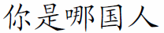

@{
  Layout = "page";
  Title = "Latex packages and tools";
  Tags = "Latex, LatexDaemon, SumatraPDF";
  Date = "";
  Description = "Latex packages and tools";
}
Latex packages and tools
========================

Here you will find some packages and tools that I have developed for Latex.

Pointing strings (pstring) package for Latex
--------------------------------------------

 The [pstring.sty](pstring.sty) package makes it easier to typeset sequences with justification pointers (also called pointing strings) in Latex. Such sequences appears frequently in computer science papers about Game Semantics. The latest version can use either PSTricks or PGF to render the arcs that represent the links. I have written a quick documentation including examples: [pstring-doc.pdf](pstring-doc.pdf). 

LatexDaemon
-----------

 [LatexDaemon](../latexdaemon/index.html) is a Windows program that accelerates significantly the compilation of Tex/Latex documents by precompiling their preamble. It runs silently in the background and automatically recompiles the Latex document when it detects modifications in the source file.

Unicode fonts installer for Latex
---------------------------------

 [This is a batch command file](../latexttf/index.html) that simplifies the instllation of Unicode TrueType fonts for LaTeX.

