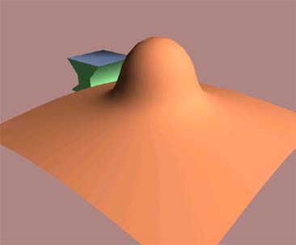
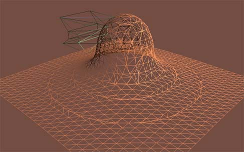

@{
  Layout = "page";
  Title = "OncelesGL";
  Tags = "";
  Date = "";
  Description = "OncelesGL";
}

# OncelesGL

  OncelesGL
==================================

OncelesGL allows you to navigate in a 3D scene and manipulate different kinds of objects. The user interface is developped using teh GLUI API and the 3D rendering is done using OpenGl. The scene is defined by a script file describing each element present in the scene as well as lighting information. There are several kind of objects that can be created: a model of a FANUC robot (developed as part of a small project that I've worked on during my studies at [IIE (France)](http://www.iie.cnam.fr/)), surfaces defined by implicit functions (of x,y,z,t), metaballs, Wavefront 3D objects (including material information) loaded from file or 3D objects defined within the scene script file. The rendering engine peforms soft shadow calculation provided that some OpenGL extensions are present. It also does some simple physics simulation (gravity and collision detection).

Download
--------

The latest version can be downloaded [ here.](oncelesgl_dist.zip)

Syntax
------

    oncelesgl.exe -f fanuc.scn -fullscreen -shadowmap 10

To load the scene containing metaballs, open the file 
metaball.scn instead of fanuc.scn

Note
----

The shadowing effect will only work if your 3D card supports the three following OpengGL extensions:

    GL_ARB_multitexture
    GL_ARB_depth_texture or GL_SGIX_depth_texture
    GL_ARB_shadow or GL_SGIX_shadow
    
Screenshots
-----------

     

