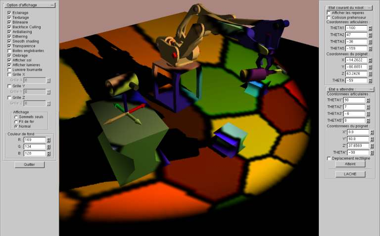
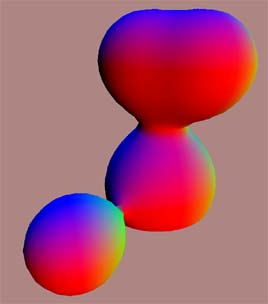

@{
  Layout = "page";
  Title = "OncelesGL";
  Tags = "";
  Date = "";
  Description = "OncelesGL";
}
<div class="markdowntitle">
# OncelesGL
</div>

  OncelesGL
==================================

**OncelesGL** allows you to navigate in a 3D scene and manipulate different kinds of objects.
The user interface is developped using teh GLUI API and the 3D rendering is done using OpenGl.
 The scene is defined by a script file describing each element present in the scene as well as
 lighting information. Several kind of objects can be added to a scene:

- 3D surfaces defined by implicit multivariate functions of space and time (`x,y,z,t`),
- Metaballs,
- Wavefront 3D objects (including material information) loaded from file or
 3D objects defined within the scene script file,
- A working model of the FANUC robot (in the screenshot below). This was developed as part of a small
 master project I worked on at [IIE (France)](http://www.ensiie.fr/?lang=en).

The rendering engine peforms soft shadow calculation provided that some OpenGL extensions are present.
It also does some simple physics simulation (gravity and collision detection).


Download
--------

The latest version can be downloaded
[ here.](oncelesgl_dist.zip)


Syntax
------

    oncelesgl.exe -f fanuc.scn -fullscreen -shadowmap 10

To load the scene containing metaballs, open the file
<span class="source">metaball.scn</span> instead of <span class="source">fanuc.scn</span>

> Note
> The shadowing effect will only work if your 3D card supports the three following OpengGL extensions:
>
>       GL_ARB_multitexture
>       GL_ARB_depth_texture or GL_SGIX_depth_texture
>       GL_ARB_shadow or GL_SGIX_shadow

Screenshots
-----------

This screenshot demonstrates the tool UI, the Fanuc robot simulation, and the shadowing capabilities:



Metaballs defined as solutions of implicit multivariate functions:





Scene Script Examples
---------------------

The metaball example above is defined by the following simple script:

```
objet = chargeWaveFront("enclume.obj", true);
iobjet3 = instancieEntite(&objet);
matriceTranslate(&iobjet3, (57, -40, 50));

enclume = chargeWaveFront("repere.obj", true);
iobjet4 = instancieEntite(&enclume);
matriceTranslate(&iobjet4, (-35, 40, 50));

insertLumiere( false, (10, 10, 100), 0, (0, 0, -1), rgba(0,0,0,255), rgba(255,255,255,255), rgba(255,255,255,255), 0, 180, 1, 0, 0, true);

mzone = metaballzone(50, 16, 16); // metaballzone(cubesize, datasize, isovalue)
matriceTranslate(&mzone , (0,0,25));

    addMetaballEx(&mzone, "sphere", 1000.0, "sinX", (0,0,10), 25);
    addMetaballEx(&mzone, "sphere", 2500.0, "sinY", (0,10,0), 25);
    addMetaballEx(&mzone, "sphere", 1001.5, "sinZ", (-10,-5,20), 50);

inst_mzone = instancieEntite(&mzone);

mzone2 = metaballzone(50, 16, 0); // metaballzone(cubesize, datasize, isovalue)
matriceTranslate(&mzone2 , (0,0,75));
inst_mzone2 = instancieEntite(&mzone2);

#include robot.inc
i1 = instancieEntite(&fanuc);
matriceTranslate( &i1, (40,50,10));
```