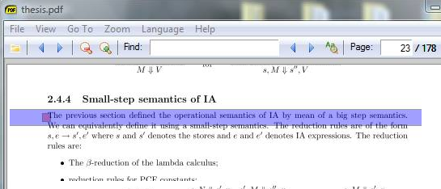
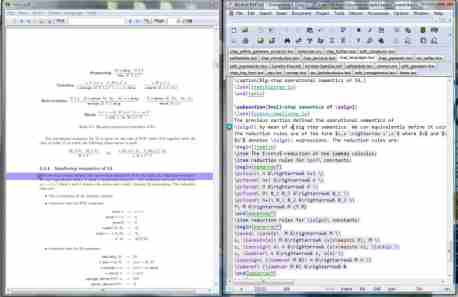

@{
  Layout = "page";
  Title = "SumatraPDF";
  Tags = "SumatraPDF, SyncTex";
  Date = "";
  Description = "LaTeX features for SumatraPDF";
}
SumatraPDF for LaTeX and TeX users
==================================

I am the original contributor of all the LaTeX features integrated in the [Sumatra PDF viewer](http://blog.kowalczyk.info/software/sumatrapdf/).
This includes: autorefresh, DDE commands, pdfsync backward and forward synchronization and synctex synchronization, and 
editor configuration UI for inverse-search.
I wrote those features back in the days (around 2005) when I was writing up my PhD thesis. (I wrote LaTeXDaemon at the same time.)
I'm happy to see that SumatraPDF has become since then the de-facto PDF viewer for LaTeX users on the Windows platform. 
By the way if you like SumatraPDF for TeX editing then you should also give
LatexDaemon a try, they work awesomely in pair!

> Note: If you are curious and want to see the corresponding commits
> in the code base take a look at the original SVN repository on Google Code under my name. 
> (Unfortunately my email address and name were scrapped when the main author moved the code from SVN to Git.) 

Screenshot
----------

Download
--------
I used to maintain my own private builds and release on this page but nowadays all those features have been integrated in the
official release of SumatraPDF. You can still download the original builds here for reference:

<ul class="home-download os_windows">
    <li class="os_windows">
    <a href="SumatraPDF-TeX.exe" class="download-link download-sumatra">
    <strong>Download SumatraPDF-TeX</strong> <em>Latest version 1.9.4502 &nbsp;(2MB)</em> 
    </a>
    </li>
</ul>

    <a href="http://blog.kowalczyk.info/software/sumatrapdf/manual.html">Manual</a>
    | <a href="http://code.google.com/p/sumatrapdf/source/browse/#svn/trunk">Sources</a>
    | <a href="http://blog.kowalczyk.info/software/sumatrapdf/">Official website</a>

Related blog posts
------------------
Here are some relate blog posts I wrote on the topic.

-   [SyncTeX-related news](../../blog/index.php?entry=entry081007-214408)
-   [SyncTeX and SumatraPDF](../../blog/index.php?entry=entry080612-040012)
-   [PDF-Latex synchronization (continued)](../../blog/index.php?entry=entry080515-065447)
-   [Synchronizing PDF files with Latex documents](../../blog/index.php?entry=entry080514-043933)
-   [Configuring editors with SumatraPDF](../../blog/static.php?page=static081010-000413)

